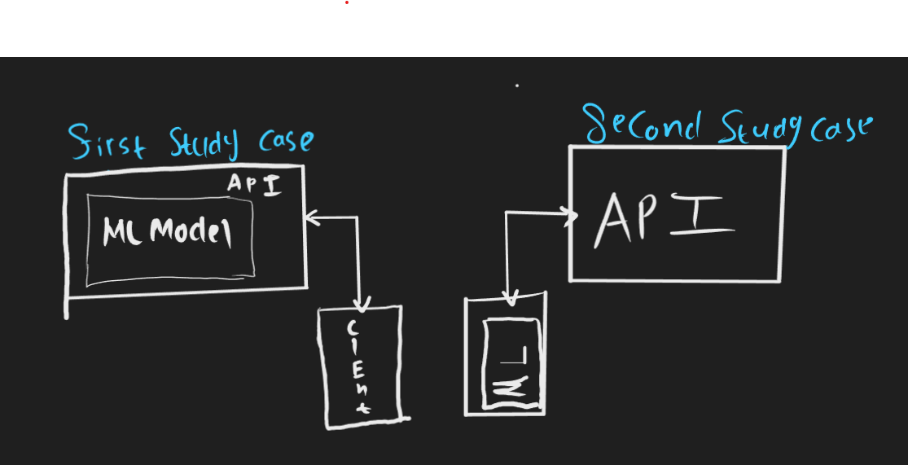

#### Just- dummy Capstone Project
### This repository created for demonstrating capstone end-to-end workflow, generally for anyone. Specifically for MD-26 

# Created by : Xorose

## Machine learning  : 
- Numpy
- Tensorflow
- Pandas
- Python 

## Android Development :
- Android Jetpack
- Tensorflow
- Retrofit
- Coroutine
- Kotlin

## Cloud Computing :
- Hapi
- JavaScript 
- I dOnT KnOw WhErE To PUt The APi xD

# Study case :
### Kalau keburu ya, full time post-graduate and also research assistant, SO xD
    - How to do image input data classification 
        - Using API
        - Local
    - How to do text input data classification 
        - Using API

## Dataset can be found here : 
- https://www.kaggle.com/datasets/sshikamaru/fruit-recognition 

-  https://www.kaggle.com/datasets/anmolkumar/fake-news-content-detection?select=train.csv

# Workflow ( End to end Communication)

#### This process is not sequential, you can do pararrel ( be creative )
## Machine learning step development
    - Create machine learning requirement
    - Find / collect Data 
    - Determine preprocessing step
    - Define learning params
    - Training
    - Error Analysis
    - Fix Error
    - Write the pros & cons of the model

## Android step development
    - Create product requirement
    - Create class relations ( Secara kasar )
    - Create UI
    - Develop UI and logic
    - Write the docs (if necessary)

## Cloud Development
    - Create API requirement
    - Develop API
    - Do API testing and security
    - Create DOCS

# Misc : 
### Machine learning documents : 
### Android documents : 
### Cloud documents : 

# This repository will be extended for Later MLOps Study case 